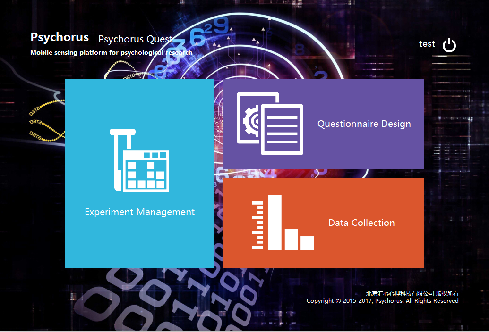
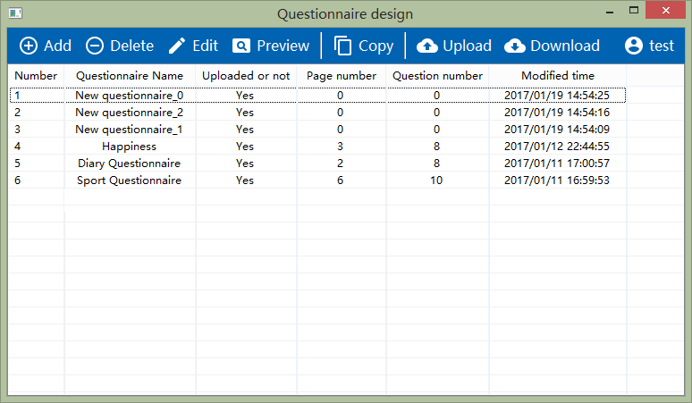
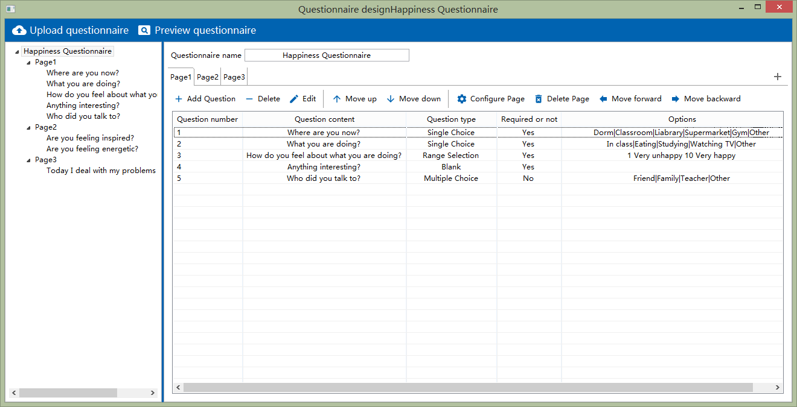
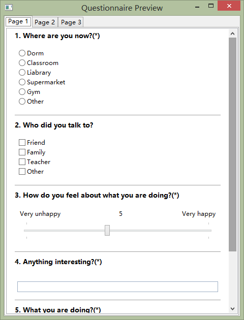
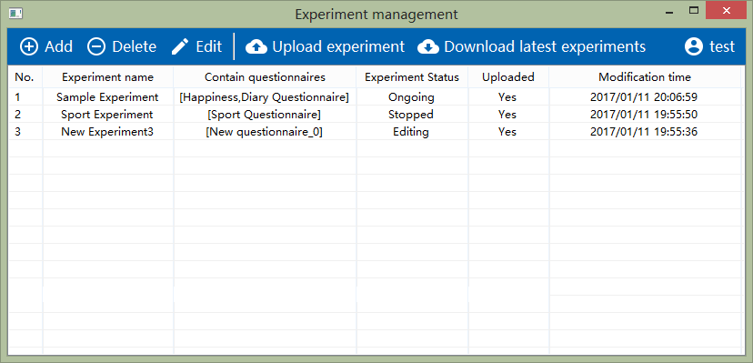
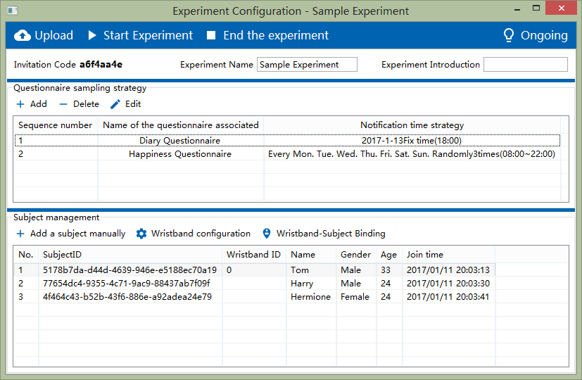
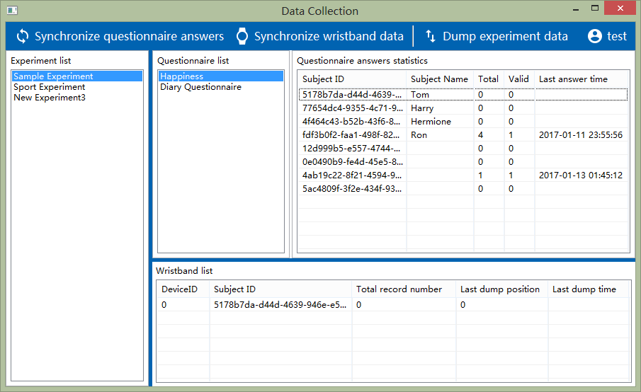
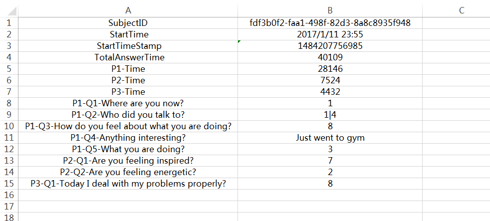
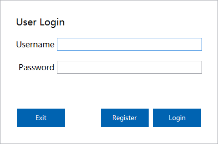
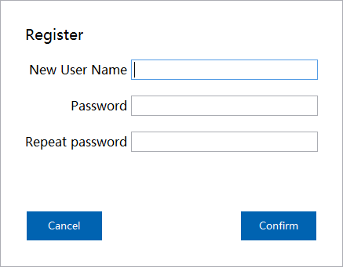

# Psychorus-Quest

Psychorus Quest is an SWT desktop application for psychological experiment management on windows. It's used for experimenters to design questionnaires, configure experiments and manage participants information.

Contributions: 
- Bisheng Huang: back logics, basic user interfaces and interactionsff
- Xiang Li: UI improvement

The hierarchies of the software windows:
- Login window
- Register window
- Portal window
    * Questionnaire list window
         - Questionnaire design window
         - Questionnaire preview window
    * Experiment list window
          - Experiment design window
    * DataCollection
   

