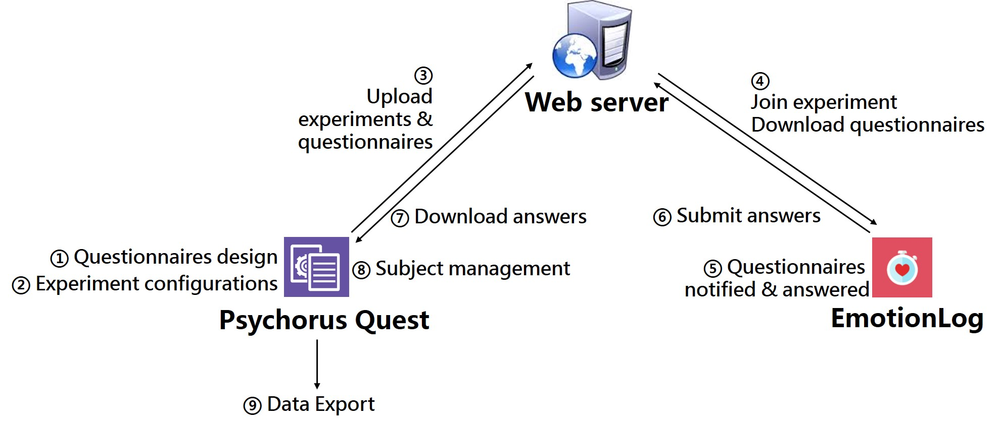

# Background

### Intuition

Traditional approches to study a person's emotions usually rely on the paper-and-pencil questionnaires experiments that take place in a lab. However, these methods rely heavily on the subjects' abilities to recall their experiences retrospectively, which might introduce bias. Recently, a research method called [Experience Sampling Method (ESM)](https://en.wikipedia.org/wiki/Experience_sampling_method) is burgeoning, in which the participants are asked to record their temporal feelings at real time or nearly real time. In this way, retrospective biases can be minimized when studying people's daily life experiences.

As part of a research project at the Department of Psychology, Tsinghua University, we developed *EmotionLog Suite*, which aims at combining the ESM and the mobile sensing technology. Using *EmotionLog Suite* , psychological researchers can carry out ESM experiments using mobile phones. It contains two applications: an SWT desktop application for experimenters(called *Psychorus Quest*), and an Android application for participants(called *EmotionLog*). 

Typically, an experiment in EmotionLog Suite is carried out as followed.

### Workflow chart

1. Questionnaires design
2. Experiment configurations
3. Upload experiments & questionnaires
4. Join experiment, download questionnaires
5. Questionnaires notified & answered
6. Submit answers
7. Download answers
8. Subject management
9. Data Export

# Psychorus-Quest

### Overview
Psychorus Quest is a experiment management platform for mobile-sensing experiments in psychological research.  

The following is the detailed introduction of Psychorus Quest. Also, see [EmotionLog](https://github.com/hbisheng/EmotionLog) for more information.
 

### Contributions: 
- Bisheng Huang: back logics, basic user interfaces and interactions
- Xiang Li: UI improvement

### Hierarchies
- Login window
- Register window
- Portal window
    * Questionnaire module
         - Questionnaire design window
         - Questionnaire preview window
    * Experiment module
          - Experiment design window
    * Data Collection module

# Screenshots demo

## Login & Register

#### Experimenters need to register & login to use the platform.

## Portial window

#### The entrances to the three main modules of Psychorus Quest.

## Questionnaire module

#### An experiment has an invitation code.

北京汇心心理科技有限公司 版权所有 Copyright © 2015-2017, Psychorus, All Rights Reserved